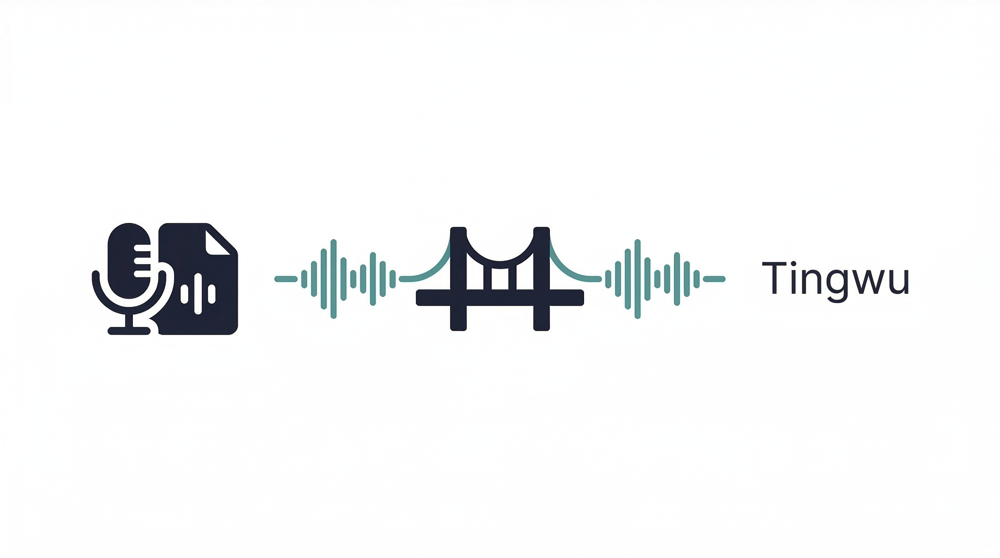
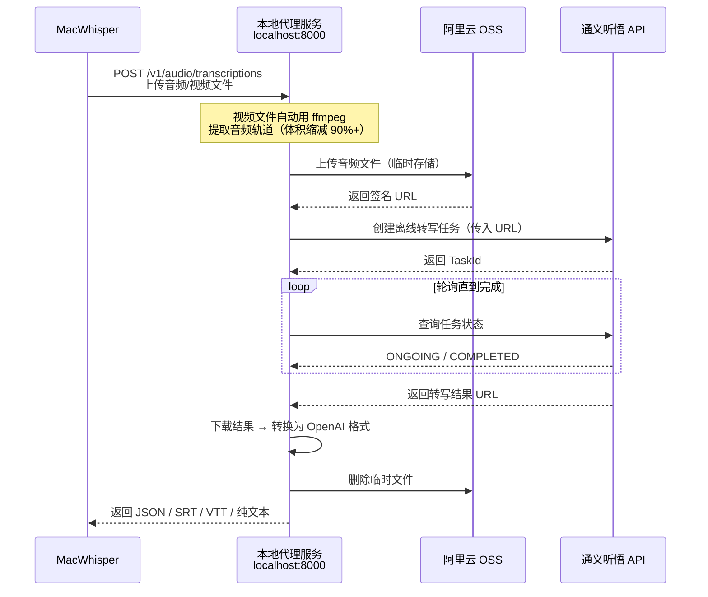

# tingwu-transcribe-proxy

<p align="center">
  
</p>

**中文** | [English](README_EN.md) | [日本語](README_JA.md)

阿里云[通义听悟](https://tingwu.aliyun.com/) → OpenAI Whisper API 兼容代理，让任何支持自定义 Whisper endpoint 的客户端都能使用通义听悟进行云端语音转写。

## 背景

[MacWhisper](https://goodsnooze.gumroad.com/l/macwhisper) 是 Mac 上体验很好的语音转文本工具，集成了 AI 总结、系统录音、会议录制等功能。但它的本地模型精度有限，且占用算力、耗时较长；而云端模型方面，海外供应商成本偏高。通义听悟是国内体验较好的云端转写服务，成本和效果都更合适；但它提供的是阿里云风格的 HTTP API/WebSocket 接口，与 OpenAI Whisper 协议不兼容。因此本项目把通义听悟能力包装成 Whisper 兼容接口，让现有客户端可以直接接入。

本项目是一个本地代理服务，将通义听悟的语音转写能力包装为 OpenAI Whisper API 兼容格式（`POST /v1/audio/transcriptions`）。**任何兼容 OpenAI Whisper API 的客户端**（MacWhisper、OpenAI Python SDK、curl 等）均可直接对接使用，不局限于某一个特定应用。

## 工作原理



## 前提条件

| 依赖 | 说明 |
|---|---|
| Python 3.9+ | 运行代理服务 |
| ffmpeg | 视频文件音频提取（macOS: `brew install ffmpeg`） |
| 阿里云账号 | 完成实名认证 |
| AccessKey | [RAM 控制台创建](https://ram.console.aliyun.com/manage/ak) |
| 通义听悟 AppKey | [开通听悟并创建项目](https://nls-portal.console.aliyun.com/tingwu/projects) |
| OSS Bucket | [创建 Bucket](https://oss.console.aliyun.com/)，建议选北京区域（`oss-cn-beijing`） |

> OSS 的作用：通义听悟 API 不接受直接上传文件，只接受公网可访问的 URL。OSS 作为临时中转站，文件用完即删，几乎不产生费用。

## 快速开始

### 1. 安装依赖

```bash
git clone https://github.com/HuAustin/tingwu-transcribe-proxy.git
cd tingwu-transcribe-proxy
pip install -r requirements.txt
```

### 2. 配置凭证

```bash
cp .env.example .env
```

编辑 `.env`，填入你的阿里云凭证：

```ini
ALIBABA_CLOUD_ACCESS_KEY_ID=你的AccessKeyId
ALIBABA_CLOUD_ACCESS_KEY_SECRET=你的AccessKeySecret
TINGWU_APP_KEY=你的听悟AppKey
OSS_BUCKET_NAME=你的Bucket名称
OSS_ENDPOINT=oss-cn-beijing.aliyuncs.com
```

### 3. 启动服务

```bash
python main.py serve
```

服务启动后监听 `http://localhost:8000`。

## 接入 MacWhisper

> 需要 MacWhisper Pro 版本（支持 Cloud Transcription 功能）。

1. 打开 MacWhisper → **Settings**（`⌘,`）→ **Cloud Transcription**
2. 找到 **Custom OpenAI Compatible** 选项
3. **Base URL** 填 `http://localhost:8000`（注意不要加 `/v1`）
4. **API Key** 随便填一个值（如 `sk-unused`），不能留空
5. 回到主界面 → 右上角**模型选择器** → 切换到 Custom cloud provider
6. 拖入音频/视频文件 → 点击转写

## CLI 模式

不依赖 MacWhisper，直接在终端转写：

```bash
# 纯文本输出
python main.py transcribe audio.mp3

# 指定语言 + SRT 字幕 + 保存到文件
python main.py transcribe meeting.wav -l cn -f srt -o meeting.srt

# 自动语言检测
python main.py transcribe video.mp4 -l auto

# 详细 JSON（含时间戳和分段）
python main.py transcribe podcast.mp3 -f verbose_json -o result.json
```

| 参数 | 说明 |
|---|---|
| `file` | 音频/视频文件路径 |
| `-l, --language` | 语言：`cn` / `en` / `yue` / `ja` / `ko` / `auto`（默认 `cn`） |
| `-f, --format` | 格式：`json` / `verbose_json` / `text` / `srt` / `vtt`（默认 `text`） |
| `-o, --output` | 输出文件路径（不指定则打印到终端） |

## API 调用

代理服务兼容 OpenAI Whisper API，任何支持自定义 endpoint 的客户端都可以直接调用。

**curl:**

```bash
curl http://localhost:8000/v1/audio/transcriptions \
  -F file=@audio.mp3 \
  -F model=tingwu-v2 \
  -F language=cn \
  -F response_format=json
```

**Python (openai 库):**

```python
from openai import OpenAI

client = OpenAI(base_url="http://localhost:8000/v1", api_key="unused")

with open("audio.mp3", "rb") as f:
    result = client.audio.transcriptions.create(
        model="tingwu-v2",
        file=f,
        language="cn",
    )
print(result.text)
```

### 响应格式

| `response_format` | 说明 |
|---|---|
| `json` | `{"text": "..."}` — OpenAI 默认格式 |
| `verbose_json` | 包含 segments（时间戳分段）、duration、language |
| `text` | 纯文本 |
| `srt` | SubRip 字幕 |
| `vtt` | WebVTT 字幕 |

## 视频文件优化

上传视频文件（mp4、mkv 等）时，代理会自动用 ffmpeg 提取音频轨道再上传，体积通常缩减 90% 以上：

| 场景 | 文件 | OSS 上传耗时 | 总处理时间 |
|---|---|---|---|
| 不优化 | 164MB mp4（原始） | ~72 秒 | ~90 秒（超时） |
| 自动优化 | ~8MB mp3（提取音频） | ~3 秒 | ~25 秒 |

仅对 10MB 以上的视频文件触发提取，小文件和纯音频文件直接上传。

## 项目结构

```
tingwu-transcribe-proxy/
├── main.py              # FastAPI 服务 + CLI 入口 + ffmpeg 音频提取
├── tingwu_client.py     # 通义听悟 API 客户端（创建任务/轮询/下载结果）
├── oss_client.py        # 阿里云 OSS 上传/删除
├── converter.py         # 转写结果格式转换（听悟 → OpenAI json/srt/vtt）
├── config.py            # 环境变量配置管理
├── requirements.txt     # Python 依赖
├── .env.example         # 环境变量模板
└── .env                 # 你的实际配置（不纳入版本控制）
```

## 配置参数

| 环境变量 | 必填 | 默认值 | 说明 |
|---|---|---|---|
| `ALIBABA_CLOUD_ACCESS_KEY_ID` | 是 | — | 阿里云 AccessKey ID |
| `ALIBABA_CLOUD_ACCESS_KEY_SECRET` | 是 | — | 阿里云 AccessKey Secret |
| `TINGWU_APP_KEY` | 是 | — | 通义听悟项目 AppKey |
| `OSS_BUCKET_NAME` | 是 | — | OSS Bucket 名称 |
| `OSS_ENDPOINT` | 否 | `oss-cn-beijing.aliyuncs.com` | OSS 接入点 |
| `OSS_PREFIX` | 否 | `tingwu-proxy/` | OSS 文件前缀路径 |
| `OSS_EXPIRE_SECONDS` | 否 | `7200` | OSS 签名 URL 有效期（秒） |
| `SERVER_HOST` | 否 | `0.0.0.0` | 服务监听地址 |
| `SERVER_PORT` | 否 | `8000` | 服务监听端口 |
| `TINGWU_POLL_INTERVAL` | 否 | `5` | 任务状态轮询间隔（秒） |
| `TINGWU_TIMEOUT` | 否 | `600` | 任务超时时间（秒） |

## 支持的文件格式

**音频：** mp3, wav, m4a, wma, aac, ogg, amr, flac, aiff

**视频（自动提取音频）：** mp4, wmv, m4v, flv, rmvb, dat, mov, mkv, webm, avi, mpeg, 3gp, ogg

文件大小限制 6GB，音频时长限制 6 小时。

## 常见问题

**Q: 服务启动后 MacWhisper 报 "The data couldn't be read because it is missing"**

检查 Base URL 是否填了 `http://localhost:8000`（不要带 `/v1`，MacWhisper 会自动拼接）。

**Q: 大文件转写超时**

确保系统安装了 ffmpeg（`brew install ffmpeg`）。代理会自动对视频文件提取音频轨道以缩减体积。如果仍然超时，可以用 CLI 模式转写，没有超时限制。

**Q: 长音频（如 2 小时以上）任务立即失败，报 `PRE.AudioDurationQuotaLimit`**

这是通义听悟侧的配额限制，不是代理代码问题。将听悟项目的音视频文件转写能力从“试用”切换为“商用”后可恢复（实测 2 小时 4 分钟音频可正常处理）。

**Q: OSS 连接报 SignatureDoesNotMatch**

AccessKey Secret 可能不完整。重新创建一对 AccessKey 并完整复制。

**Q: ffmpeg 未安装**

```bash
# macOS
brew install ffmpeg

# Ubuntu/Debian
sudo apt install ffmpeg
```

没有 ffmpeg 时，视频文件会以原始大小上传，小视频仍可正常转写，大视频可能超时。

## License

MIT
