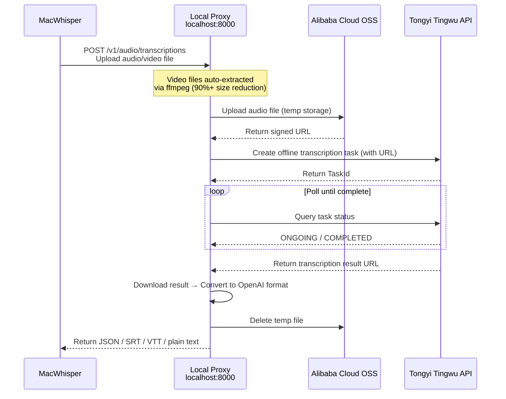

# tingwu-transcribe-proxy

[中文](README.md) | **English** | [日本語](README_JA.md)

Alibaba Cloud [Tongyi Tingwu](https://tingwu.aliyun.com/) → OpenAI Whisper API compatible proxy. Enables any client that supports a custom Whisper endpoint to use Tongyi Tingwu for cloud-based speech transcription.

## Background

[MacWhisper](https://goodsnooze.gumroad.com/l/macwhisper) is an excellent speech-to-text app on Mac with AI summarization, system audio recording, and meeting capture. However, its local models have limited accuracy and consume significant compute resources. On the cloud side, overseas providers are costly. Tongyi Tingwu offers high-quality transcription at a fraction of the price, but it exposes Alibaba Cloud-style HTTP API/WebSocket interfaces that are incompatible with the OpenAI Whisper protocol. This project bridges Tongyi Tingwu's API to deliver accurate, affordable cloud transcription while wrapping it into a Whisper-compatible interface.

This project is a local proxy service that wraps Tongyi Tingwu's transcription capabilities into an OpenAI Whisper API compatible format (`POST /v1/audio/transcriptions`). **Any client compatible with the OpenAI Whisper API** (MacWhisper, OpenAI Python SDK, curl, etc.) can connect directly — it is not limited to any specific application.

## How It Works



## Prerequisites

| Dependency | Description |
|---|---|
| Python 3.9+ | Run the proxy service |
| ffmpeg | Video audio extraction (macOS: `brew install ffmpeg`) |
| Alibaba Cloud account | With real-name verification |
| AccessKey | [Create in RAM Console](https://ram.console.aliyun.com/manage/ak) |
| Tongyi Tingwu AppKey | [Enable Tingwu & create project](https://nls-portal.console.aliyun.com/tingwu/projects) |
| OSS Bucket | [Create Bucket](https://oss.console.aliyun.com/), Beijing region recommended (`oss-cn-beijing`) |

> Why OSS? Tongyi Tingwu API does not accept direct file uploads — it requires a publicly accessible URL. OSS serves as a temporary relay; files are deleted after use, incurring almost no cost.

## Quick Start

### 1. Install Dependencies

```bash
git clone https://github.com/HuAustin/tingwu-transcribe-proxy.git
cd tingwu-transcribe-proxy
pip install -r requirements.txt
```

### 2. Configure Credentials

```bash
cp .env.example .env
```

Edit `.env` with your Alibaba Cloud credentials:

```ini
ALIBABA_CLOUD_ACCESS_KEY_ID=YourAccessKeyId
ALIBABA_CLOUD_ACCESS_KEY_SECRET=YourAccessKeySecret
TINGWU_APP_KEY=YourTingwuAppKey
OSS_BUCKET_NAME=YourBucketName
OSS_ENDPOINT=oss-cn-beijing.aliyuncs.com
```

### 3. Start the Service

```bash
python main.py serve
```

The service will listen on `http://localhost:8000`.

## Connect to MacWhisper

> Requires MacWhisper Pro (Cloud Transcription feature).

1. Open MacWhisper → **Settings** (`⌘,`) → **Cloud Transcription**
2. Find **Custom OpenAI Compatible**
3. Set **Base URL** to `http://localhost:8000` (do NOT append `/v1`)
4. Set **API Key** to any value (e.g. `sk-unused`) — cannot be empty
5. Return to main window → select **Custom cloud provider** from the model selector (top right)
6. Drag in an audio/video file → start transcription

## CLI Mode

Transcribe directly from the terminal without MacWhisper:

```bash
# Plain text output
python main.py transcribe audio.mp3

# Specify language + SRT subtitles + save to file
python main.py transcribe meeting.wav -l cn -f srt -o meeting.srt

# Auto language detection
python main.py transcribe video.mp4 -l auto

# Verbose JSON (with timestamps and segments)
python main.py transcribe podcast.mp3 -f verbose_json -o result.json
```

| Parameter | Description |
|---|---|
| `file` | Audio/video file path |
| `-l, --language` | Language: `cn` / `en` / `yue` / `ja` / `ko` / `auto` (default `cn`) |
| `-f, --format` | Format: `json` / `verbose_json` / `text` / `srt` / `vtt` (default `text`) |
| `-o, --output` | Output file path (prints to terminal if not specified) |

## API Usage

The proxy is compatible with the OpenAI Whisper API. Any client that supports custom endpoints can call it directly.

**curl:**

```bash
curl http://localhost:8000/v1/audio/transcriptions \
  -F file=@audio.mp3 \
  -F model=tingwu-v2 \
  -F language=cn \
  -F response_format=json
```

**Python (openai library):**

```python
from openai import OpenAI

client = OpenAI(base_url="http://localhost:8000/v1", api_key="unused")

with open("audio.mp3", "rb") as f:
    result = client.audio.transcriptions.create(
        model="tingwu-v2",
        file=f,
        language="cn",
    )
print(result.text)
```

### Response Formats

| `response_format` | Description |
|---|---|
| `json` | `{"text": "..."}` — OpenAI default format |
| `verbose_json` | Includes segments (timestamped), duration, language |
| `text` | Plain text |
| `srt` | SubRip subtitles |
| `vtt` | WebVTT subtitles |

## Video File Optimization

When uploading video files (mp4, mkv, etc.), the proxy automatically extracts the audio track using ffmpeg before uploading, typically reducing file size by over 90%:

| Scenario | File | OSS Upload Time | Total Processing Time |
|---|---|---|---|
| No optimization | 164MB mp4 (original) | ~72s | ~90s (timeout) |
| Auto optimization | ~8MB mp3 (extracted audio) | ~3s | ~25s |

Extraction is only triggered for video files larger than 10MB. Small files and pure audio files are uploaded directly.

## Project Structure

```
tingwu-transcribe-proxy/
├── main.py              # FastAPI service + CLI entry + ffmpeg audio extraction
├── tingwu_client.py     # Tongyi Tingwu API client (create task / poll / download)
├── oss_client.py        # Alibaba Cloud OSS upload/delete
├── converter.py         # Result format conversion (Tingwu → OpenAI json/srt/vtt)
├── config.py            # Environment variable configuration
├── requirements.txt     # Python dependencies
├── .env.example         # Environment variable template
└── .env                 # Your actual config (not tracked by git)
```

## Configuration

| Environment Variable | Required | Default | Description |
|---|---|---|---|
| `ALIBABA_CLOUD_ACCESS_KEY_ID` | Yes | — | Alibaba Cloud AccessKey ID |
| `ALIBABA_CLOUD_ACCESS_KEY_SECRET` | Yes | — | Alibaba Cloud AccessKey Secret |
| `TINGWU_APP_KEY` | Yes | — | Tongyi Tingwu project AppKey |
| `OSS_BUCKET_NAME` | Yes | — | OSS Bucket name |
| `OSS_ENDPOINT` | No | `oss-cn-beijing.aliyuncs.com` | OSS endpoint |
| `OSS_PREFIX` | No | `tingwu-proxy/` | OSS file prefix path |
| `OSS_EXPIRE_SECONDS` | No | `7200` | OSS signed URL expiry (seconds) |
| `SERVER_HOST` | No | `0.0.0.0` | Service listen address |
| `SERVER_PORT` | No | `8000` | Service listen port |
| `TINGWU_POLL_INTERVAL` | No | `5` | Task status poll interval (seconds) |
| `TINGWU_TIMEOUT` | No | `600` | Task timeout (seconds) |

## Supported File Formats

**Audio:** mp3, wav, m4a, wma, aac, ogg, amr, flac, aiff

**Video (auto audio extraction):** mp4, wmv, m4v, flv, rmvb, dat, mov, mkv, webm, avi, mpeg, 3gp, ogg

File size limit: 6GB. Audio duration limit: 6 hours.

## FAQ

**Q: MacWhisper shows "The data couldn't be read because it is missing" after starting the service**

Check that the Base URL is `http://localhost:8000` (do not include `/v1` — MacWhisper appends it automatically).

**Q: Large file transcription times out**

Make sure ffmpeg is installed (`brew install ffmpeg`). The proxy automatically extracts audio from video files to reduce size. If it still times out, use CLI mode which has no timeout limit.

**Q: OSS connection returns SignatureDoesNotMatch**

The AccessKey Secret may be incomplete. Re-create an AccessKey pair and copy it in full.

**Q: ffmpeg not installed**

```bash
# macOS
brew install ffmpeg

# Ubuntu/Debian
sudo apt install ffmpeg
```

Without ffmpeg, video files are uploaded at their original size. Small videos will still work, but large videos may time out.

## License

MIT
