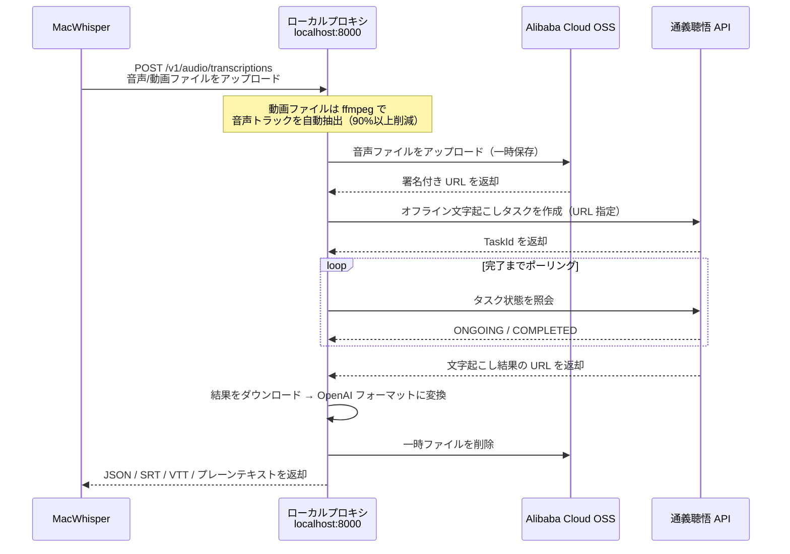

# tingwu-transcribe-proxy

[中文](README.md) | [English](README_EN.md) | **日本語**

アリババクラウド [通義聴悟（Tongyi Tingwu）](https://tingwu.aliyun.com/) → OpenAI Whisper API 互換プロキシ。カスタム Whisper エンドポイントをサポートする任意のクライアントから通義聴悟のクラウド音声文字起こしを利用できます。

## 背景

[MacWhisper](https://goodsnooze.gumroad.com/l/macwhisper) は Mac 上で優れた音声文字起こしアプリであり、AI 要約、システム音声録音、会議録音などの機能を備えています。しかし、ローカルモデルは精度に限界があり、計算リソースの消費と処理時間も課題です。一方、海外のクラウドプロバイダーはコストが高くなります。通義聴悟はコストと品質の両面で有力な選択肢ですが、アリババクラウド独自の HTTP API/WebSocket インターフェースを採用しており、OpenAI Whisper プロトコルとは互換性がありません。そのため、本プロジェクトは通義聴悟を Whisper 互換インターフェースとして提供し、既存クライアントから直接接続できるようにします。

本プロジェクトは、通義聴悟の音声文字起こし機能を OpenAI Whisper API 互換フォーマット（`POST /v1/audio/transcriptions`）にラップするローカルプロキシサービスです。**OpenAI Whisper API 互換の任意のクライアント**（MacWhisper、OpenAI Python SDK、curl など）から直接接続でき、特定のアプリケーションに限定されません。

## 仕組み



## 前提条件

| 依存関係 | 説明 |
|---|---|
| Python 3.9+ | プロキシサービスの実行 |
| ffmpeg | 動画からの音声抽出（macOS: `brew install ffmpeg`） |
| アリババクラウドアカウント | 実名認証済み |
| AccessKey | [RAM コンソールで作成](https://ram.console.aliyun.com/manage/ak) |
| 通義聴悟 AppKey | [聴悟を有効化してプロジェクトを作成](https://nls-portal.console.aliyun.com/tingwu/projects) |
| OSS バケット | [バケットを作成](https://oss.console.aliyun.com/)、北京リージョン推奨（`oss-cn-beijing`） |

> OSS の役割：通義聴悟 API はファイルの直接アップロードを受け付けず、公開アクセス可能な URL が必要です。OSS は一時的な中継役として使用され、使用後すぐに削除されるため、費用はほぼ発生しません。

## クイックスタート

### 1. 依存関係のインストール

```bash
git clone https://github.com/HuAustin/tingwu-transcribe-proxy.git
cd tingwu-transcribe-proxy
pip install -r requirements.txt
```

### 2. 認証情報の設定

```bash
cp .env.example .env
```

`.env` をアリババクラウドの認証情報で編集します：

```ini
ALIBABA_CLOUD_ACCESS_KEY_ID=あなたのAccessKeyId
ALIBABA_CLOUD_ACCESS_KEY_SECRET=あなたのAccessKeySecret
TINGWU_APP_KEY=あなたの聴悟AppKey
OSS_BUCKET_NAME=あなたのバケット名
OSS_ENDPOINT=oss-cn-beijing.aliyuncs.com
```

### 3. サービスの起動

```bash
python main.py serve
```

サービスは `http://localhost:8000` でリッスンします。

## MacWhisper との接続

> MacWhisper Pro 版が必要です（Cloud Transcription 機能対応）。

1. MacWhisper を開く → **Settings**（`⌘,`）→ **Cloud Transcription**
2. **Custom OpenAI Compatible** を選択
3. **Base URL** に `http://localhost:8000` を入力（`/v1` は付けないこと）
4. **API Key** に任意の値を入力（例：`sk-unused`）— 空欄不可
5. メイン画面に戻る → 右上の**モデルセレクター** → Custom cloud provider を選択
6. 音声/動画ファイルをドラッグ＆ドロップ → 文字起こしを開始

## CLI モード

MacWhisper なしで、ターミナルから直接文字起こし：

```bash
# プレーンテキスト出力
python main.py transcribe audio.mp3

# 言語指定 + SRT 字幕 + ファイルに保存
python main.py transcribe meeting.wav -l cn -f srt -o meeting.srt

# 自動言語検出
python main.py transcribe video.mp4 -l auto

# 詳細 JSON（タイムスタンプとセグメント付き）
python main.py transcribe podcast.mp3 -f verbose_json -o result.json
```

| パラメータ | 説明 |
|---|---|
| `file` | 音声/動画ファイルのパス |
| `-l, --language` | 言語：`cn` / `en` / `yue` / `ja` / `ko` / `auto`（デフォルト `cn`） |
| `-f, --format` | フォーマット：`json` / `verbose_json` / `text` / `srt` / `vtt`（デフォルト `text`） |
| `-o, --output` | 出力ファイルパス（未指定の場合はターミナルに出力） |

## API の使用

プロキシは OpenAI Whisper API と互換性があります。カスタムエンドポイントをサポートするクライアントから直接呼び出せます。

**curl:**

```bash
curl http://localhost:8000/v1/audio/transcriptions \
  -F file=@audio.mp3 \
  -F model=tingwu-v2 \
  -F language=cn \
  -F response_format=json
```

**Python (openai ライブラリ):**

```python
from openai import OpenAI

client = OpenAI(base_url="http://localhost:8000/v1", api_key="unused")

with open("audio.mp3", "rb") as f:
    result = client.audio.transcriptions.create(
        model="tingwu-v2",
        file=f,
        language="cn",
    )
print(result.text)
```

### レスポンスフォーマット

| `response_format` | 説明 |
|---|---|
| `json` | `{"text": "..."}` — OpenAI デフォルトフォーマット |
| `verbose_json` | セグメント（タイムスタンプ付き）、duration、language を含む |
| `text` | プレーンテキスト |
| `srt` | SubRip 字幕 |
| `vtt` | WebVTT 字幕 |

## 動画ファイルの最適化

動画ファイル（mp4、mkv など）をアップロードすると、プロキシは ffmpeg を使って音声トラックを自動抽出してからアップロードします。通常 90% 以上のサイズ削減が可能です：

| シナリオ | ファイル | OSS アップロード時間 | 合計処理時間 |
|---|---|---|---|
| 最適化なし | 164MB mp4（オリジナル） | 約72秒 | 約90秒（タイムアウト） |
| 自動最適化 | 約8MB mp3（音声抽出済み） | 約3秒 | 約25秒 |

抽出は 10MB 以上の動画ファイルに対してのみ実行されます。小さいファイルや音声ファイルはそのままアップロードされます。

## プロジェクト構成

```
tingwu-transcribe-proxy/
├── main.py              # FastAPI サービス + CLI エントリ + ffmpeg 音声抽出
├── tingwu_client.py     # 通義聴悟 API クライアント（タスク作成/ポーリング/ダウンロード）
├── oss_client.py        # Alibaba Cloud OSS アップロード/削除
├── converter.py         # 結果フォーマット変換（聴悟 → OpenAI json/srt/vtt）
├── config.py            # 環境変数設定管理
├── requirements.txt     # Python 依存パッケージ
├── .env.example         # 環境変数テンプレート
└── .env                 # 実際の設定ファイル（git 管理外）
```

## 設定パラメータ

| 環境変数 | 必須 | デフォルト | 説明 |
|---|---|---|---|
| `ALIBABA_CLOUD_ACCESS_KEY_ID` | はい | — | アリババクラウド AccessKey ID |
| `ALIBABA_CLOUD_ACCESS_KEY_SECRET` | はい | — | アリババクラウド AccessKey Secret |
| `TINGWU_APP_KEY` | はい | — | 通義聴悟プロジェクト AppKey |
| `OSS_BUCKET_NAME` | はい | — | OSS バケット名 |
| `OSS_ENDPOINT` | いいえ | `oss-cn-beijing.aliyuncs.com` | OSS エンドポイント |
| `OSS_PREFIX` | いいえ | `tingwu-proxy/` | OSS ファイルプレフィックスパス |
| `OSS_EXPIRE_SECONDS` | いいえ | `7200` | OSS 署名付き URL 有効期限（秒） |
| `SERVER_HOST` | いいえ | `0.0.0.0` | サービスリッスンアドレス |
| `SERVER_PORT` | いいえ | `8000` | サービスリッスンポート |
| `TINGWU_POLL_INTERVAL` | いいえ | `5` | タスク状態ポーリング間隔（秒） |
| `TINGWU_TIMEOUT` | いいえ | `600` | タスクタイムアウト（秒） |

## サポートされるファイル形式

**音声：** mp3, wav, m4a, wma, aac, ogg, amr, flac, aiff

**動画（音声自動抽出）：** mp4, wmv, m4v, flv, rmvb, dat, mov, mkv, webm, avi, mpeg, 3gp, ogg

ファイルサイズ上限：6GB、音声時間上限：6時間。

## よくある質問

**Q: サービス起動後、MacWhisper で「The data couldn't be read because it is missing」と表示される**

Base URL が `http://localhost:8000` になっているか確認してください（`/v1` は付けないでください — MacWhisper が自動的に付加します）。

**Q: 大きなファイルの文字起こしがタイムアウトする**

ffmpeg がインストールされていることを確認してください（`brew install ffmpeg`）。プロキシは動画ファイルから自動的に音声を抽出してサイズを削減します。それでもタイムアウトする場合は、タイムアウト制限のない CLI モードを使用してください。

**Q: OSS 接続で SignatureDoesNotMatch エラー**

AccessKey Secret が不完全な可能性があります。AccessKey ペアを再作成し、完全にコピーしてください。

**Q: ffmpeg がインストールされていない**

```bash
# macOS
brew install ffmpeg

# Ubuntu/Debian
sudo apt install ffmpeg
```

ffmpeg がない場合、動画ファイルは元のサイズでアップロードされます。小さな動画は正常に動作しますが、大きな動画はタイムアウトする可能性があります。

## License

MIT
